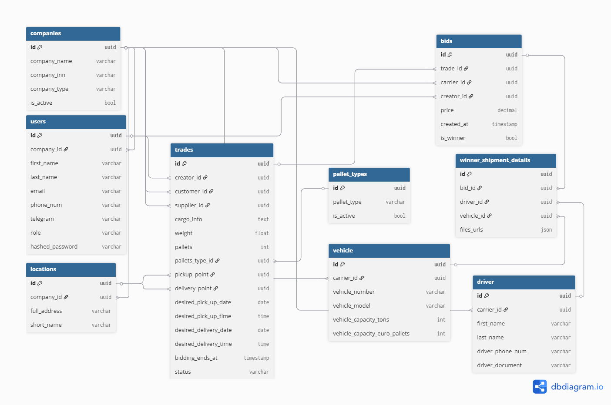

<h1 align="center">Hi there, I'm <a href="https://github.com/eeugene152/" target="_blank">Eugene Emelkhovsky</a> 
</h1>
<h3 align="center">Back/Front-end learner from Russia 🇷🇺</h3>


# Проект «Logistics Auction Platform (FastAPI)» — описание:
«Logistics Auction Platform» — Система проведения тендеров на грузоперевозки. Позволяет компаниям-заказчикам размещать заявки, а транспортным компаниям — предлагать свои ставки в режиме реального времени.
## Адрес на GIT
### https://github.com/eeugene152/logistics-tender-portal

Мой "pet"-проект в рамках отработыки навыков в backend и веб-разработке. Это "Портал логистических торгов", созданный с использованием фрейма FastAPI(первый этап) и современных инструментов CSS (второй этап).

## 🎯 Цели проекта
- улучшить навыки в создании API-backend.
- улучшение навыков HTML, CSS в рамках текущего обучения
- получить работающий проект, как итоговая цель - использование его на текущем месте работы (в сфере поставок и логистики)

## 🛠 Технологии в проекте
*   **Backend:** Python 3.12, FastAPI (Asynchronous)
*   **Database:** PostgreSQL 15, SQLAlchemy 2.0 (Mapped Declarative), Alembic
*   **Validation:** Pydantic v2 (Pydantic-settings)
*   **Infrastructure:** Docker, Docker Compose (Healthchecks, Volumes)
*   **Web:** Jinja2 Templates (на текущем этапе), JS (Fetch API)

## 🏗 Текущая архитектура
Проект построен по модульному принципу для легкого перехода на полноценный Frontend (React/Vue):
- `app/core/`: Глобальные настройки, конфиг БД и сессий.
- `app/models/`: Описательные модели SQLAlchemy (Data Layer).
- `app/schemas/`: Схемы валидации Pydantic.
- `app/api/`: Эндпоинты, разделенные по зонам ответственности.
- `app/crud/`: Инкапсулированная логика взаимодействия с базой.

## 📊 Схема базы данных

Реализованы следующие сущности и связи:
- **Компании и Пользователи:** Поддержка ролей (Заказчик, Поставщик, Перевозчик).
- **Торги (Trades):** Полный цикл заявки (груз, локации, паллеты, тайминги аукциона).
- **Ставки (Bids):** Механика выбора победителя.
- **Исполнение (Shipments):** Назначение водителя, ТС и хранение документов (JSON).


## 🚀 Крупные победы и автоматизация (Сентябрь 2026)

### Автоматизация развертывания и защита инфраструктуры Alembic
Полностью переработан цикл инициализации контейнеров в `entrypoint.sh`. Реализован механизм автоматической очистки папки миграций (`migrations/versions/`) от невалидных файлов прошлых запусков и системного кэша Python (`__pycache__`) при обнаружении чистой базы данных. Система стала на 100% отказоустойчивой на стыке Windows и Docker Volumes, гарантируя генерацию чистой начальной миграции и успешный старт бэкенда в один клик через `docker-compose down -v && docker-compose up -d --build`.

### Универсальный движок автозасева базы данных (Data Seeding)
Спроектирован и внедрен промышленный инструмент `UniversalDataSeeder` (в связке с `SEED_REGISTRY` и системными настройками `Settings`). Движок работает по принципу коврового сканирования: он автоматически обходит папки сущностей в `app/seeds/`, поочередно обрабатывая **все** найденные файлы в форматах `.json` и `.xlsx` (Excel).
После **засева** вормируются логи по всем моделям - сколько строк загружено, сколько пропущено.

В сидер заложена надежная защита:
- **Превентивная фильтрация дубликатов**: перед записью строки сидер делает запрос в базу по уникальному бизнес-ключу (ИНН для компаний, Email для пользователей). Если запись уже существует, строка пропускается на взлете, предотвращая конфликты.
- **Изоляция ошибок валидации**: при обнаружении некорректных полей или опечаток в файле данных Pydantic отсекает битую строку, сидер пишет предупреждение в логи и спокойно продолжает загрузку всех остальных правильных строк. Бэкенд защищен от падения из-за человеческого фактора.

### 🌐 Супер-универсальный Web-импорт (Админ-панель)
Интегрирован единый диспетчерский эндпоинт `/api/v1/admin/import/{entity}/` для ручной загрузки данных администратором через веб-интерфейс (Swagger). Роутер спроектирован тотально универсальным на базе `ImportEntity`.

Эндпоинт автоматически адаптируется под выбранную сущность: принимает файл `.json` или `.xlsx`, передает бинарный поток в оперативную память бэкенда (без сохранения на диск сервера), динамически извлекает настройки из `SEED_REGISTRY` и запускает конвейер валидации и записи. 

### 🔄 Динамические перечисления API (Тотальный DRY)
Реализована динамическая генерация классов FastAPI-типов. Вместо ручного хардкода доступных таблиц в API, класс перечисления `ImportEntity` создается «на лету» в оперативной памяти во время старта сервера, считывая актуальные ключи из центрального реестра `SEED_REGISTRY`. 

Интерактивная документация Swagger автоматически адаптируется под изменения конфигурации, предоставляя администратору всегда актуальный выпадающий список (Dropdown) сущностей для загрузки. Обслуживание кодовой базы снижено до нуля: расширение контура импорта под новые таблицы (например, машины, сделки) теперь происходит в **один шаг** — путем добавления сущности в реестр, полностью минуя правку слоя API-роутеров.


## 🛠 Рефакторинг и оптимизация
- to be updated

## 🛠 Запуск проекта
Проект полностью контейнеризирован. Для запуска достаточно:

1. Создать файл `.env` на основе `.env.example` (укажите свои креды для БД).
2. Запустить сборку:
   ```bash
       docker-compose up --build
   ```
3. Система автоматически:
   Дождется готовности PostgreSQL.
   Прогонит все миграции Alembic.
   Запустит приложение через Gunicorn (Uvicorn workers).
   API будет доступно по адресу: http://localhost:8000/docs

📈 Статус разработки (Milestones)
* Веха 1: Инфраструктура, Docker, асинхронное окружение.
* Веха 2: Проектирование БД, кастомные типы (Annotated), миграции.
* Веха 3: Реализация CRUD и бизнес-логики (в процессе).
* Веха 4: API Routes и JWT авторизация.
* Веха 5: Интерфейс - Frontend Templates & JS.
* Веха 6: Тесты pytest для проверки работоспособности
* Веха 7: Автоматизация и Деплой - Настройка GitHub Actions и запуск на удаленном сервере.

## 📈 Чему я научился
1. Проектирование сложных БД: Отработал построение связей «многие-к-одному» и «один-к-одному», использовал миксины для автоматизации и кастомные типы (Annotated) для соблюдения принципа DRY.
2. Асинхронная архитектура: Использовал в работе AsyncSession в SQLAlchemy и асинхронными драйверами (asyncpg), что критично для производительности FastAPI.
3. Контейнеризация и оркестрация: Связал сервисы через docker-compose, настроил Healthcheck для базы и управление Volumes для сохранности данных.
4. Управление миграциями: Настройка Alembic на асинхронный лад и разруливание конфликтов путей импорта в Docker.
5. Clean Architecture: Применил модульный подход, разделяя ответственность между моделями, схемами и бизнес-логикой (CRUD), что делает проект готовым к масштабированию.


### [Посмотреть проект на GitHub](https://github.com/eeugene152/logistics-tender-portal)
# Авторство:
- GitHub: [@eeugene152](https://github.com/eeugene152/)
- Telegram: [@eemelkhovsky](https://t.me/eemelkhovsky/)

-----
*Проект выполнен в учебнj-прикладных целях.*
